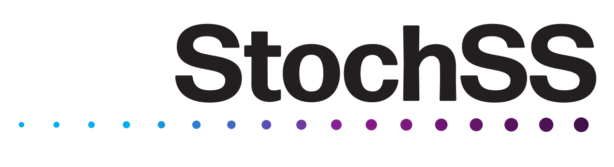
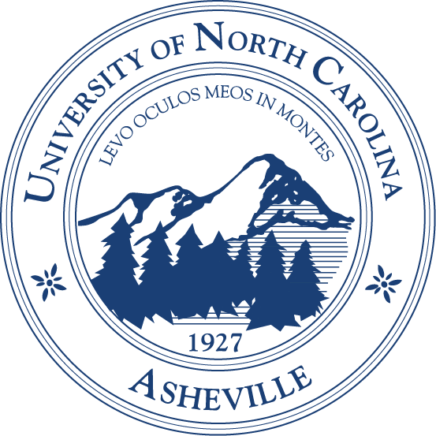

GillesPy2
=========

GillesPy2 is a Python package for stochastic simulation of biochemical systems.  It offers an object-oriented approach for creating mathematical models of biological systems, as well as a variety of methods for performing time simulation of those models.  The methods include the [Gillespie direct method (SSA)](https://en.wikipedia.org/wiki/Gillespie_algorithm), several variant stochastic simulation methods including [tau-leaping](https://en.wikipedia.org/wiki/Tau-leaping), and numerical integration of ODEs.  The solvers support a variety of runtime environments, with optimized code for C++, [Cython](https://cython.org), and [NumPy](https://numpy.org).  GillesPy2 also supports [SBML](https://en.wikipedia.org/wiki/SBML).

<table><tr><td><b>

GillesPy2 is part of the <a href="http://www.stochss.org">StochSS</a> project. We rely on grants to sustain development.<br><a href="https://docs.google.com/forms/d/12tAH4f8CJ-3F-lK44Q9uQHFio_mGoK0oY829q5lD7i4/viewform">PLEASE REGISTER AS A USER</a>, so that we can demonstrate GillesPy2's popularity!</b>
</td></tr></table>

[](https://pypi.org/project/gillespy2)


Table of contents
-----------------

* [Installation](#installation)
* [Usage](#usage)
* [Getting help](#getting-help)
* [Contributing](#contributing)
* [License](#license)
* [Authors and history](#authors-and-history)
* [Acknowledgments](#acknowledgments)

Installation
------------

GillesPy2 can be installed on your computer using different methods, as described below.

### Using PyPI

Using Python 3 on **Linux**, **macOS**, and **Windows** operating systems, you should be able to install GillesPy2 with [pip](https://pip.pypa.io/en/stable/installing/):
```
python3 -m pip install --upgrade pip
python3 -m pip install gillespy2
```

### Using the source code repository

As an alternative to getting it from PyPI, you can instruct `pip` to install GillesPy2 directly from the GitHub repository:
```sh
sudo python3 -m pip install git+https@github.com:GillesPy2/GillesPy2.git --upgrade
```

As a final alternative, you can first use `git` to clone a copy of the GillesPy2 source tree from the GitHub repository and then install it using that copy:
```sh
git clone --recursive https@github.com:GillesPy2/GillesPy2.git
cd GillesPy2
sudo python3 -m pip install . --upgrade
```

Usage
-----

GillesPy2 performs stochastic biochemical simulations using simplified object-oriented abstractions.  The basic steps to use GillesPy2 are:

1. create (or SBML import) a GillesPy2.Model containing species, parameters, and reactions.
2. call the model's '.run()' method.

The run method can be customized using keyword arguments to select different solvers, random seed, data return type and more.
For more detailed examples on how to use GillesPy2, please see the [Getting Started](https://github.com/GillesPy2/GillesPy2/tree/master/examples/Getting-Started.ipynb) notebook contained in the [examples](https://github.com/GillesPy2/GillesPy2/tree/master/examples) subdirectory.


Getting help
------------

GillesPy2's [online document](https://gillespy2.github.io/GillesPy2/) provides more details about using the software.  If you find any problem with GillesPy2 or the documentation, please report it using [the GitHub issue tracker](https://github.com/GillesPy2/GillesPy2/issues) for this repository.  You can also contact Dr. [Brian Drawert](http://www.cs.unca.edu/~drawert) directly with questions and suggestions.


Contributing
------------

We would be happy to receive your help and participation with enhancing GillesPy2!  Please follow the guidelines described in [CONTRIBUTING.md](https://github.com/GillesPy2/GillesPy2/tree/master/CONTRIBUTING.md).


License
-------

GillesPy2 is licenced under the GNU General Public License version 3.  Please see the file [LICENCE](LICENSE) for more information.


Authors and history
---------------------------

* **Dr. Brian Drawert** 
* **Dr. Kevin Sanft**
* **Ghilman Brock**
* **Eliot Dixon**
* **Dalton Nickerson**
* **Sean Matthew**
* **George Hall** 
* **W.R. Jackson** 
* **Samuel Hodges**
* **Emma Weisgerber**


Acknowledgments
---------------

This work has been funded by National Institutes of Health (NIH) NIBIB Award No. 2R01EB014877-04A1.

GillesPy2 uses numerous open-source packages, without which it would have been effectively impossible to develop this software with the resources we had.  We want to acknowledge this debt.  In alphabetical order, the packages are:

* [Jupyter](https://jupyter.org) &ndash; web application for creating documents containing code, visualizations and narrative text
* [libSBML](http://sbml.org/Software/libSBML) &ndash; a library for reading, writing, and manipulating SBML content
* [lxml](https://lxml.de) &ndash; an XML parsing library for Python
* [MatplotLib](https://matplotlib.org/index.html) &ndash; Python 2D plotting library
* [Numpy](http://www.numpy.org/) &ndash; the fundamental package for scientific computing with Python
* [Scipy](https://www.scipy.org/) &ndash; Python-based ecosystem of open-source software for mathematics, science, and engineering

Finally, we are grateful for institutional resources made available by the [UNC Asheville](https://www.unca.edu), the [University of California, Santa Barbara](https://ucsb.edu), [Uppsala University](https://www.it.uu.se), and the [California Institute of Technology](https://www.caltech.edu).

<div align="center">
  <a href="https://www.nigms.nih.gov">
    
  </a>
  &nbsp;&nbsp;
  <a href="https://www.unca.edu">
    
  </a>
  &nbsp;&nbsp;
  <a href="https://www.ucsb.edu">
    
  </a>
  &nbsp;&nbsp;
  <a href="https://www.it.uu.se">
    
  </a>
  &nbsp;&nbsp;
  <a href="https://www.caltech.edu">
    
  </a>
</div>


## Build Status

| Master Branch |  Develop Branch | Coverage |
|----------------|---|---|
| [](https://travis-ci.org/GillesPy2/GillesPy2) | [](https://travis-ci.org/GillesPy2/GillesPy2) |  |
