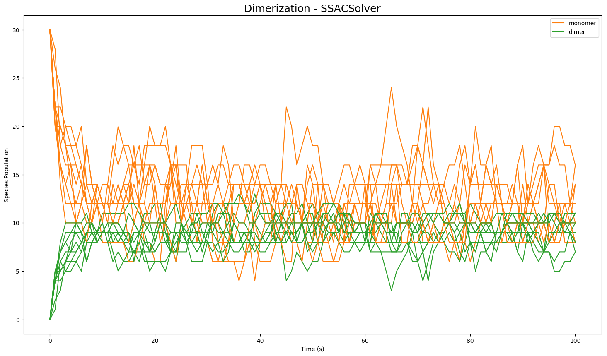

GillesPy2
=========

GillesPy2 is a Python package for stochastic simulation of biochemical systems.  It offers an object-oriented approach for creating mathematical models of biological systems, as well as a variety of methods for performing time simulation of those models.  The methods include the [Gillespie direct method (SSA)](https://en.wikipedia.org/wiki/Gillespie_algorithm), several variant stochastic simulation methods including [tau-leaping](https://en.wikipedia.org/wiki/Tau-leaping), and numerical integration of ODEs.  The solvers support a variety of user environments, with optimized code for C++, [Cython](https://cython.org), and [NumPy](https://numpy.org).  GillesPy2 also supports [SBML](https://en.wikipedia.org/wiki/SBML).

<table><tr><td><b>

<a href="https://docs.google.com/forms/d/12tAH4f8CJ-3F-lK44Q9uQHFio_mGoK0oY829q5lD7i4/viewform">PLEASE REGISTER AS A USER</a>, so that we can prove GillesPy2 has many users when we seek funding to support development. GillesPy2 is part of the <a href="http://www.stochss.org">StochSS</a> project.
</td></tr></table>

[](https://pypi.org/project/gillespy2)


Table of contents
-----------------

* [Installation](#installation)
* [Usage](#usage)
* [Getting help](#getting-help)
* [Contributing](#contributing)
* [License](#license)
* [Authors and history](#authors-and-history)
* [Acknowledgments](#acknowledgments)

Installation
------------

GillesPy2 can be installed on your computer using different methods, as described below.

### _Using PyPI_

On **Linux**, **macOS**, and **Windows** operating systems, you should be able to install GillesPy2 with [pip](https://pip.pypa.io/en/stable/installing/).  If you don't have the `pip` package or are uncertain, first run the following command in a terminal command line interpreter: 
```
sudo python3 -m ensurepip
```

Then, to install GillesPy2 from the Python package repository, run the following command:
```
python3 -m pip install gillespy2 --user --upgrade
```

### _Using the source code repository_

As an alternative to getting it from PyPI, you can instruct `pip` to install GillesPy2 directly from the GitHub repository:
```sh
python3 -m pip install git+https@github.com:GillesPy2/GillesPy2.git --user --upgrade
```

As a final alternative, you can first use `git` to clone a copy of the GillesPy2 source tree from the GitHub repository to your local computer disk, and then install GillesPy2 using that copy:
```sh
git clone --recursive https@github.com:GillesPy2/GillesPy2.git
cd GillesPy2
python3 -m pip install  .  --user --upgrade
```

Usage
-----

GillesPy2 provides simple object-oriented abstractions for defining a model of a biochemical system and simulating that model using efficient stochastic simulation algorithms.  The basic steps to use GillesPy2 are:

1. Create a `GillesPy2.Model` containing molecular species, parameters, and reactions (or import it from an [SBML](http://sbml.org) file)
2. Invoke the model's `.run()` method.

The `run()` method can be customized using keyword arguments to select different solvers, random seed, data return type and more.  For more detailed examples on how to use GillesPy2, please see the [Getting Started](https://github.com/GillesPy2/GillesPy2/tree/master/examples/Getting-Started.ipynb) Jupyter notebook contained in the [examples](https://github.com/GillesPy2/GillesPy2/tree/master/examples) subdirectory.


### _Simple example to illustrate the use of GillesPy2_

[Dimerization](https://www.ncbi.nlm.nih.gov/books/NBK26830) is a process in which two molecules of some molecular species (known as a "monomer" in this situation &ndash; let's call it "M" for short) come together to create a new molecule (call it "D"), but do so in a way that is reversible, meaning the combined structure can also decay or dissociate back into "M".  A simple model of the dimerization process represents it as two reactions: a reaction in which one molecule of "M" reacts with another molecule of "M" to form one new molecule ("D"), and another reaction in which a molecule of "D" breaks apart into two molecules of "M".  In terms of biochemical reactions, it looks like this (where _k<sub>c</sub>_ and _k<sub>d</sub>_ represent the rate constants for creation and dissociation of the dimer, respectively; _M_ represents the number of molecules of "M"; and _D_ is the number of molecules of "D"):

<p align="center">
    &nbsp;&nbsp;&nbsp;&nbsp;&nbsp;<i>k<sub>c</sub></i><br>
  <i>2 M</i>&nbsp;&nbsp;⟷ <i>D</i><br>
    &nbsp;&nbsp;&nbsp;&nbsp;&nbsp;<i>k<sub>d</sub></i><br>
</p>

In GillesPy2, a model is expressed as an object having the parent class `Model`.  Components of the model, such as the reactions, molecular species, and characteristics such as the time span for simulation, are all defined within the subclass definition.  The following Python code represents our dimerization model using GillesPy2's facility:

```python
class Dimerization(gillespy2.Model):
    def __init__(self, parameter_values=None):
        # First call the gillespy2.Model initializer.
        super().__init__(self)

        # Define parameters for the rates of creation and dissociation.
        k_c = gillespy2.Parameter(name='k_c', expression=0.005)
        k_d = gillespy2.Parameter(name='k_d', expression=0.08)
        self.add_parameter([k_c, k_d])

        # Define variables for the molecular species representing M and D.
        m = gillespy2.Species(name='monomer', initial_value=30)
        d = gillespy2.Species(name='dimer',   initial_value=0)
        self.add_species([m, d])

        # The list of reactants and products for a Reaction object are each a
        # Python dictionary in which the dictionary keys are Species objects
        # and the values are stoichiometries of the species in the reaction.
        r_c = gillespy2.Reaction(name="r_creation", rate=k_c, reactants={m:2}, products={d:1})
        r_d = gillespy2.Reaction(name="r_dissociation", rate=k_d, reactants={d:1}, products={m:2})
        self.add_reaction([r_c, r_d])

        # Set the timespan for the simulation.
        self.timespan(numpy.linspace(0, 100, 101))
```

Given the class definition above, the model can be simulated by first instantiating the class object, and then invoking the `run()` method on the object.  The following code will run the model 10 times to produce 10 sample trajectories:

```python
model = Dimerization()
results = model.run(number_of_trajectories=10)
```

The format of the results from a run is is an array of values for different time points.  There will be one subarray for each trajectory.  In the current example, we can plot each of the 10 trajectories in the same figure using the following code:

```python
for index in range(0, 10):
    trajectory = results[index]
    plt.plot(trajectory['time'], trajectory['monomer'], 'r')
    plt.plot(trajectory['time'], trajectory['dimer'],   'b')
```

With a few additional Python Matplotlib commands to create figure labels and such, we end up with a plot like this:

<p align="center">

</p>


Getting help
------------

GillesPy2's [online document](https://gillespy2.github.io/GillesPy2/) provides more details about using the software.  If you find any problem with GillesPy2 or the documentation, please report it using [the GitHub issue tracker](https://github.com/GillesPy2/GillesPy2/issues) for this repository.  You can also contact Dr. [Brian Drawert](http://www.cs.unca.edu/~drawert) directly with questions and suggestions.


Contributing
------------

We would be happy to receive your help and participation with enhancing GillesPy2!  Please follow the guidelines described in [CONTRIBUTING.md](https://github.com/GillesPy2/GillesPy2/tree/master/CONTRIBUTING.md).


License
-------

GillesPy2 is licensed under the GNU General Public License version 3.  Please see the file [LICENCE](LICENSE) for more information.


Authors and history
---------------------------

* [**Dr. Brian Drawert** ](https://github.com/briandrawert)
* [**Dr. Kevin Sanft**](https://github.com/kevinsanft)
* [**Ghilman Brock**](https://github.com/GhilmanBrock)
* [**Eliot Dixon**](https://github.com/edixon1)
* [**Dalton Nickerson**](https://github.com/Thisisnotdalton)
* [**Sean Matthew**](https://github.com/seanebum)
* [**George Hall** ](https://github.com/georgemhall)
* [**W.R. Jackson** ](https://github.com/JustJackson)
* [**Samuel Hodges**](https://github.com/hodgespodge)
* [**Emma Weisgerber**](https://github.com/eweisger)

New developments happen primarily in the [`develop`](https://github.com/GillesPy2/GillesPy2/commits/develop) branch.  New releases are put in the `master` branch.

<p align="center">

| Master Branch   | Develop Branch | Coverage |
|:---------------:|:--------------:|:--------:|
| [](https://travis-ci.org/GillesPy2/GillesPy2) | [](https://travis-ci.org/GillesPy2/GillesPy2) |  |


Acknowledgments
---------------

This work has been funded by National Institutes of Health (NIH) NIBIB Award No. 2R01EB014877-04A1.

GillesPy2 uses numerous open-source packages, without which it would have been effectively impossible to develop this software with the resources we had.  We want to acknowledge this debt.  In alphabetical order, the packages are:

* [Jupyter](https://jupyter.org) &ndash; web application for creating documents containing code, visualizations and narrative text
* [libSBML](http://sbml.org/Software/libSBML) &ndash; a library for reading, writing, and manipulating SBML content
* [lxml](https://lxml.de) &ndash; an XML parsing library for Python
* [MatplotLib](https://matplotlib.org/index.html) &ndash; Python 2D plotting library
* [Numpy](http://www.numpy.org/) &ndash; the fundamental package for scientific computing with Python
* [Scipy](https://www.scipy.org/) &ndash; Python-based ecosystem of open-source software for mathematics, science, and engineering

Finally, we are grateful for institutional resources made available by the [UNC Asheville](https://www.unca.edu), the [University of California at Santa Barbara](https://ucsb.edu), [Uppsala University](https://www.it.uu.se), and the [California Institute of Technology](https://www.caltech.edu).

<div align="center">
  <a href="https://www.nigms.nih.gov">
    
  </a>
  &nbsp;&nbsp;
  <a href="https://www.unca.edu">
    
  </a>
  &nbsp;&nbsp;
  <a href="https://www.ucsb.edu">
    
  </a>
  &nbsp;&nbsp;
  <a href="https://www.it.uu.se">
    
  </a>
  &nbsp;&nbsp;
  <a href="https://www.caltech.edu">
    
  </a>
</div>
