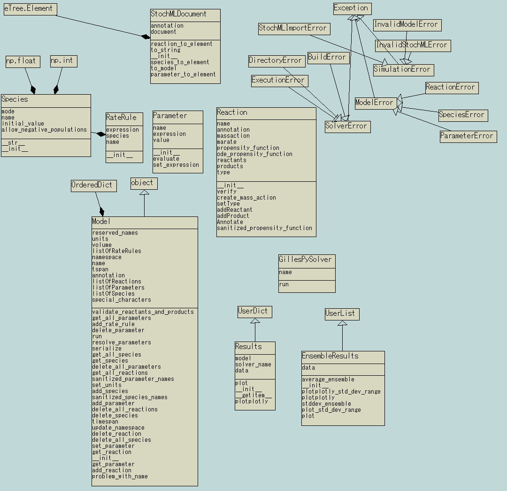

# UML Class Diagram

This diagram was built from a [UML class model](gillespy2-UML-class-model.pyns) created by [Pynsource](https://pynsource.com/), an open-source UML tool for Python. It displays the major functional elements (classes) of GillesPy2:

-StochMLDocument: affords serializiation and deserialization of a GillesPy2 model to/from the native StochKit2 XML format.

-Species, RateRule, Parameter, Reaction: elements of a GillesPy2 model.

-Model: contains Species, RateRule, Parameter, and Reaction objects that make up a GillesPy2 model.

-GillesPySolver: a mathematical algorithm for running a Model object, creating a Results object containing simulation data.

-Results: a dictionary containing data from a simulation trajectory generated by running a Model via a solver.

-EnsembleResults: a list of data dictionaries from multiple trajectories generated by running the same Model over multiple instances.

