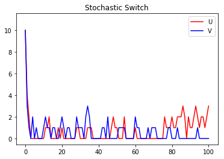
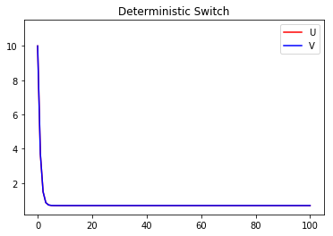

Tutorial: ODE vs. SSA
#####################

Deterministic ordinary differential equation (ODE) models of biochemical processes are useful and accurate in the high-concentration limit, but often fail to capture stochastic cellular dynamics accurately because the deterministic continuous formulation assumes spatial homogeneity and continuous biomolecule concentrations.  Nevertheless, ODE simulations are appropriate in some situations.  GillesPy2 includes ODE solvers as well as stochastic solvers, and thus allows you to compare the results of both.  This tutorial demonstrates the use of both ODE and stochastic simulation on the same model.

First, in a Python script that uses GillesPy2 to perform model simulation, we begin by importing some basic Python packages needed in the rest of the script:

.. code-block:: python

 import numpy
 import matplotlib.pyplot as plt
 import gillespy2
 from gillespy2 import Model, Species, Parameter, Reaction
 from gillespy2.solvers.numpy.basic_ode_solver import BasicODESolver

Next, we define a model. This is a model based on a publication by Gardner et al. in Nature, 1999, and represents a genetic toggle switch in Escherichia coli.  In GillesPy2, a model is expressed as an object having the parent class ``Model``.  Components of the model, such as the reactions, molecular species, and characteristics such as the time span for simulation, are all defined within the subclass definition.  The following Python code represents our model using GillesPy2's facility:

.. code-block:: python

 class ToggleSwitch(Model):
   def __init__(self, parameter_values = None):
     # Initialize the model.
     Model.__init__(self, name = "toggle_switch")

     # Define parameters.
     alpha1 = Parameter(name = 'alpha1', expression = 1)
     alpha2 = Parameter(name = 'alpha2', expression = 1)
     beta   = Parameter(name = 'beta',   expression = 2.0)
     gamma  = Parameter(name = 'gamma',  expression = 2.0)
     mu     = Parameter(name = 'mu',     expression = 1.0)
     self.add_parameter([alpha1, alpha2, beta, gamma, mu])

     # Define molecular species.
     U = Species(name = 'U', initial_value = 10)
     V = Species(name = 'V', initial_value = 10)
     self.add_species([U, V])

     # Define reactions.
     cu = Reaction(name = "r1", reactants = {}, products = {U:1},
                   propensity_function = "alpha1/(1+pow(V,beta))")
     cv = Reaction(name = "r2", reactants = {}, products = {V:1},
                   propensity_function = "alpha2/(1+pow(U,gamma))")
     du = Reaction(name = "r3", reactants = {U:1}, products = {},
                   rate = mu)
     dv = Reaction(name = "r4", reactants = {V:1}, products = {},
                   rate = mu)
     self.add_reaction([cu, cv, du, dv])
     self.timespan(numpy.linspace(0, 100, 101))

Given the class definition above, the model can be simulated by first instantiating the class object, and then invoking the ``run()`` method on the object.  Invoking ``run()`` without any values for the ``solver`` keyword argument makes GillesPy2 use the basic SSA solver.

.. code-block:: python

 model = ToggleSwitch()
 s_results = model.run(show_labels = False)

We can run the model again, this time using a deterministic ODE solver.

.. code-block:: python

 d_results = model.run(solver = BasicODESolver, show_labels = False)

Now, let's plot the results of the two methods.  First, a plot of the stochastic simulation results:

.. code-block:: python

 plt.plot(s_results[0][:,0], s_results[0][:,1], '-r', label='U')
 plt.plot(s_results[0][:,0], s_results[0][:,2], '-b', label='V')
 plt.plot([0], [11])
 plt.title('Stochastic Switch')
 plt.legend(loc = 'best')

And here is a plot of the deterministic simulation results:

.. code-block:: python

 plt.plot(d_results[0][:,0], d_results[0][:,1], '-r', label='U')
 plt.plot(d_results[0][:,0], d_results[0][:,2], '-b', label='V')
 plt.plot([0], [11])
 plt.title('Stochastic Switch')
 plt.legend(loc = 'best')

